# CSCI 3907: Computation Photography - Project 2: Hybrid Images

## Team Members
- Jack Umina
- Graham Schock
- Jonathan Lee

## Main Algorithm

The main idea of the hybrid image alogorithm is to first apply a low pass filter over the first image. This has the effect of bluring the first input image. Next, the second input filter's image matrix is subtracted by the same images result after have the low pass filter applied. This yields the second input image with a high pass filter applied. The effect here is the second image's high frequency features are maintained.

### Low Pass Filter

```python
low_pass_image = sk.filters.gaussian(img, sigma=sigma, multichannel=True)
```

The actual implementation of the low pass filter is a guassian blur with a varying sigma. We implemented it such that the sigma coult be changed with each image pairs. Through our experimentation, it was helpful to adjust the sigma depending on each input image. Some images required a smaller sigma to reduce the amount of blue applied so that its features were more easily reconizable in the final hybrid image.

### High Pass Filter

```python
high_pass_image = original_image - apply_low_pass_fltr(img, sigma=sigma)
```

The implementation of the high pass filter is taking the original image and subtracting it by the low pass image. This has an effect of producing an image with only the high frequency regions remaining. Similar to the low pass filter, we also found it helpful here to adjust the sigma on a case by case basis. A higher sigma will increase the blur and result in more distinct features in the result of the high pass filter.

### Frequency Analysis
| Input Image 1 | Input 1 with low pass filter | Input Image 2 | Input 2 with high pass filter | Hybrid Image |
| --- | --- | --- | --- | --- |
|  |  |  |  |  |
| 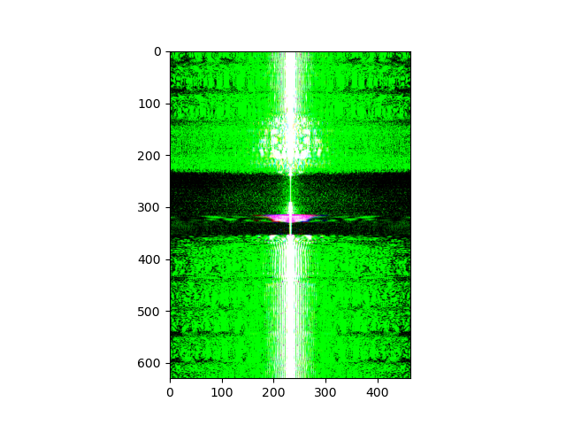 | 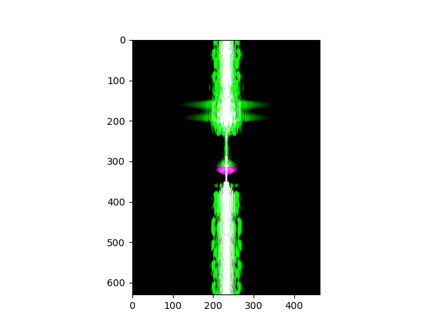 | 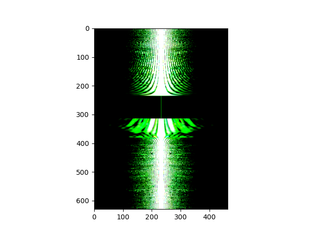 |  | 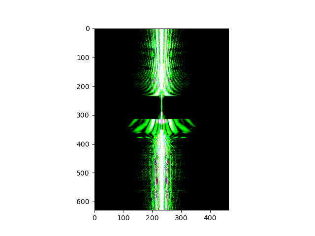 |


### Result Comparisons

| Input Image 1 | Input 1 with low pass filter | Input Image 2 | Input 2 with high pass filter | Hybrid Image |
| --- | --- | --- | --- | --- |
| 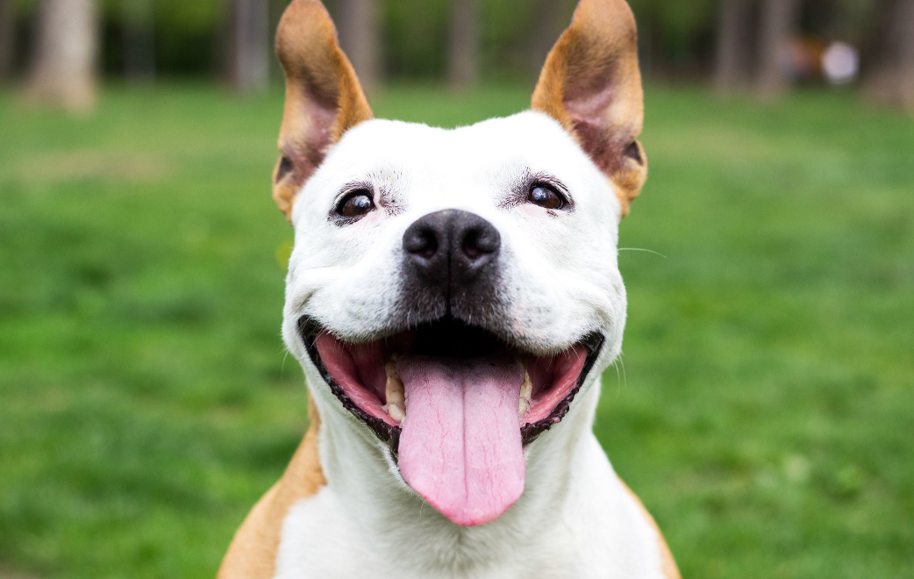 | 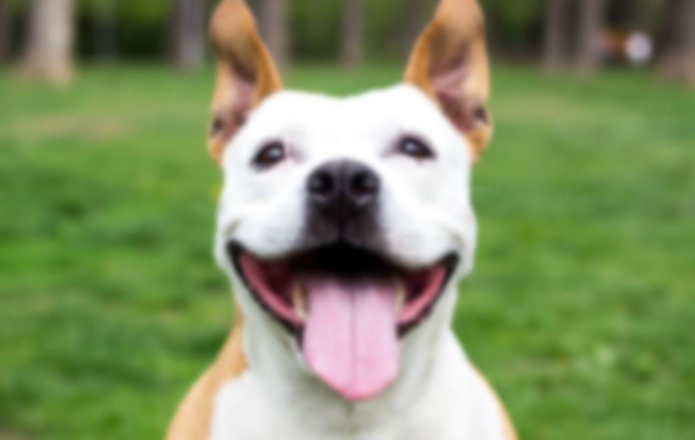 |  |  |  |
|  |  |  |  | 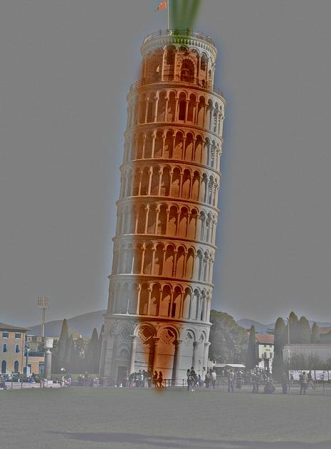 |
|  |  |  |  |  |
|  |  |  | 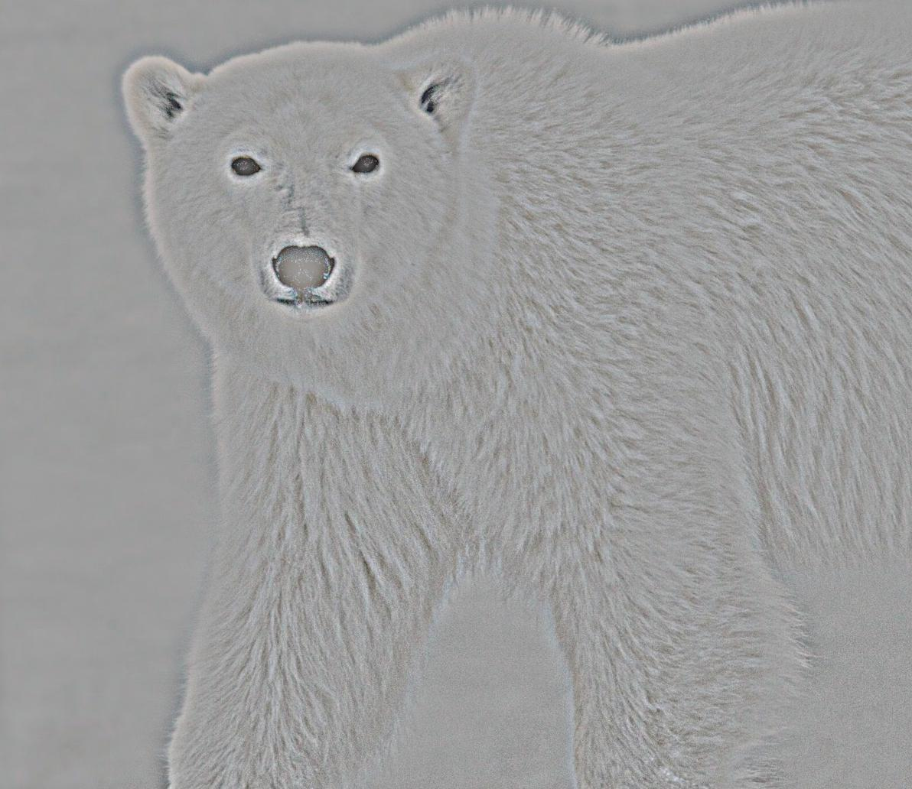 | 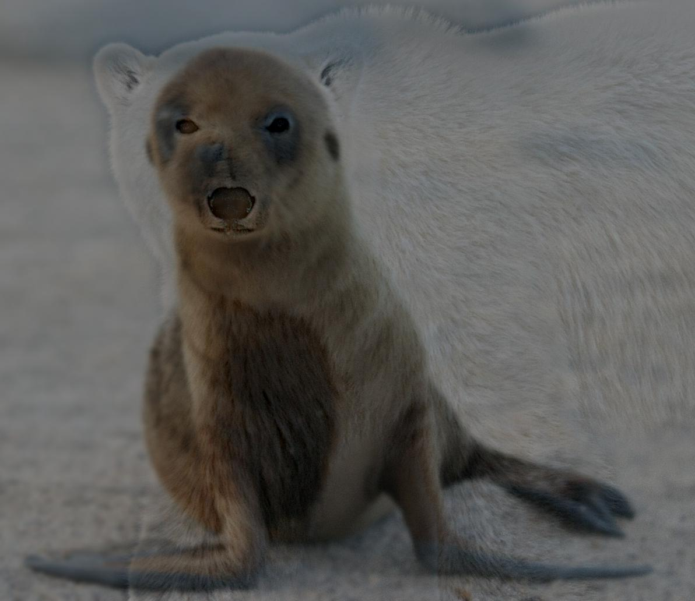 |
|  |  |  | 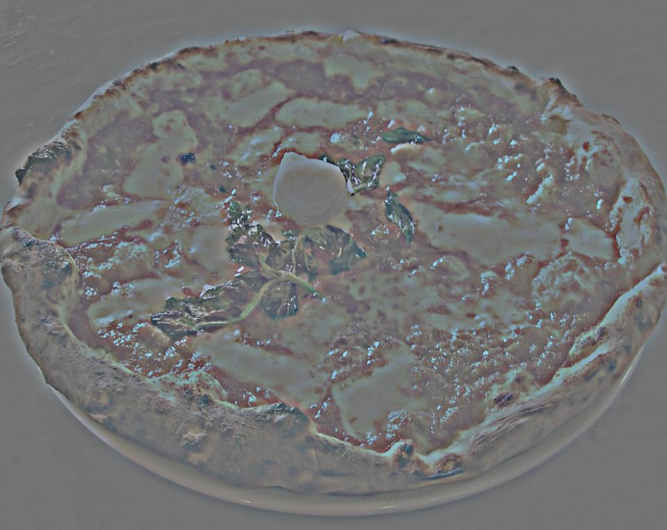 | 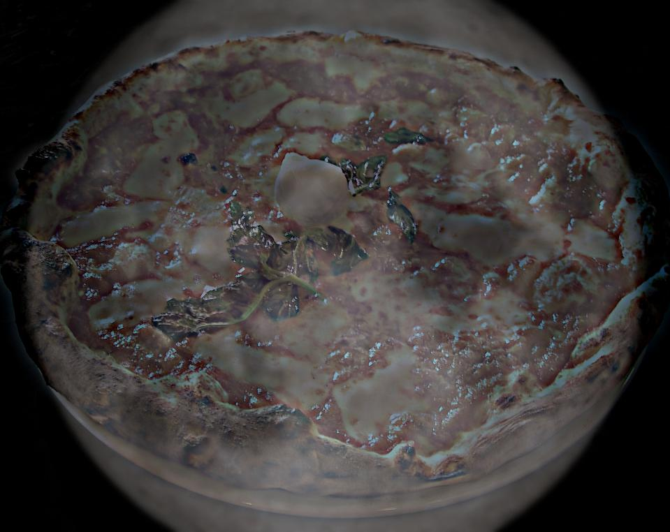 |


## Automatic Video Generation

Having a user squint their eyes to be able to visualize a low pass filter is not user friendly.

We decided to implement automatic video generation that would allow the user to see how an image would change if we view the high frequency vs the low frequency. 

### Implementation
To make an image look smaller, while keeping the important data and proportions we decided to use different levels of [jpeg](https://en.wikipedia.org/wiki/JPEG) compression.

We use the [imagemagik](https://imagemagick.org/index.php) library to compress a hybrid image by a certain percentage to get 80 frames of gradual image compression.

After we compress we want to add padding around the image so that all frames are the same size so we can eventually combine them into a video. We decided to center the image in the frame and fill the rest with black pixels.

After we generate all of the frames we would then combine them into a .gif file with a small delay between each frame and adding more time to the first and last frame so that the user can see the difference between the high pass and the low pass filters. 

```python
def generate_frame(compression_percent, img1, img2):
    hybrid_img = hybrid(img1, img2)
    compress_hybrid = compress(compression_percentage), hybrid_img) # ImageMagick function to compress an image by a certain percentage
    return add_padding(compress_hybrid, sizeof(hybrid_img)) # Add padding so that all of the frames are the same size
    
for i in range(20, 100):
    image_arr.push(generate_frame(i, img1, img2)

```

### Results


